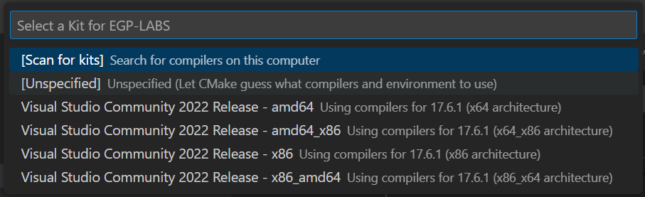
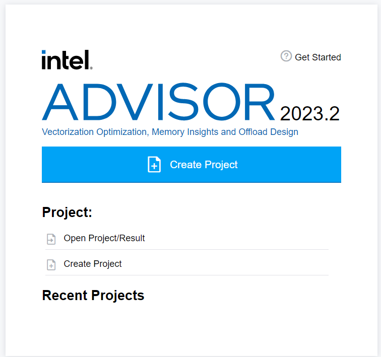
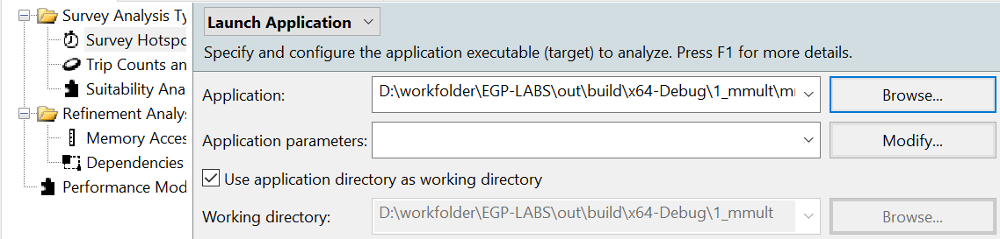
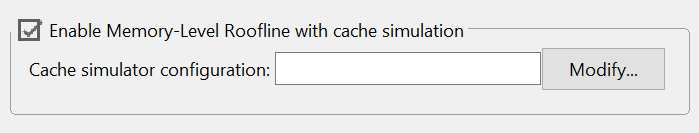
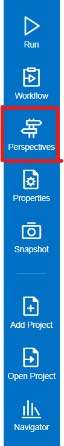
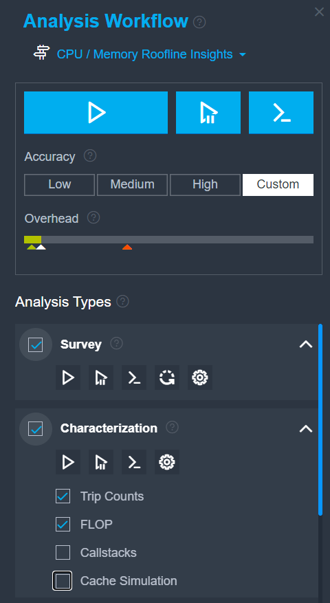
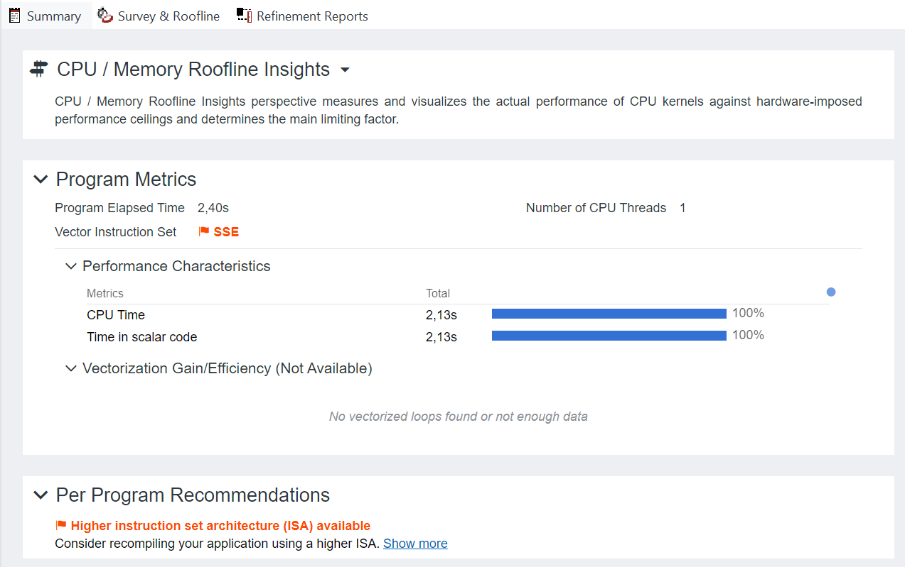
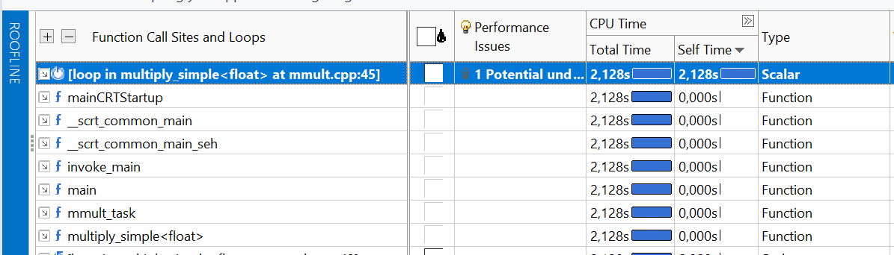
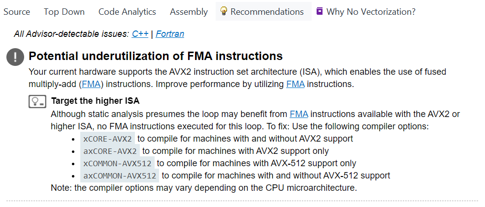

# Lab1. Настройка окружения. Некоторые методы повышения производительности приложения. Эффективность работы с подсистемой памяти. Векторизация.
### Подготовка к выполнению лабораторных работ

1) Необходимо установить инструменты из пакета Intel oneAPI:
    - compiler
    - advisor
    - vtune
    - inspector
    
    Первые три доступны в рамках Intel oneAPI Base Toolkit. Последний в Intel oneAPI HPC Toolkit.

2) Настройка окружения

    Прежде всего необходимо выполнить скрипт setvars.bat, который располагается в корневой папке с установленными иснтрументами из пакета oneAPI. Наприме, путь до него может быть следующим:
    ```
    "C:\Program Files (x86)\Intel\oneAPI\setvars.bat"
    ```
    Для запуска скрипта нужно открыть командную строку: win + s -> ищем cmd (Командная строка) и запускаем это приложение. Далее в открывшейся командной строке вводим полный путь до скрипта, описанного выше, в консоли появится следующее:
    ```
    Microsoft Windows [Version 10.0.19044.2728]
    (c) Корпорация Майкрософт (Microsoft Corporation). Все права защищены.

    C:\Users\k.sandalov>"C:\Program Files (x86)\Intel\oneAPI\setvars.bat"
    :: initializing oneAPI environment...
    Initializing Visual Studio command-line environment...
    Visual Studio version 17.6.1 environment configured.
    "C:\Program Files\Microsoft Visual Studio\2022\Community\"
    Visual Studio command-line environment initialized for: 'x64'
    :  advisor -- latest
    :  compiler -- latest
    :  debugger -- latest
    :  dev-utilities -- latest
    :  dpl -- latest
    :  tbb -- latest
    :  vtune -- latest
    :: oneAPI environment initialized ::

    C:\Users\k.sandalov>
    ```

    Затем открываем средство разработки, используя эту же командную строку.
    В качестве возможных средств разработки предлагается рассмотреть VS Code или же просто Visual Studio (версия от 2016 года или новее).
    - VS Code
        
        Для запуска VS Code можно ввести следующую команду в терминале:
        ```
        C:\Users\k.sandalov>code
        ```
        Для работы с проектом в VS Code нужны следующие расширения (Скачать можно на вкладке Extensions):

        
        

        Далее в открывшемся окне переходим в верхнем меню к выбору папки, в которой располагается проект(корневая директория проекта):

        

        После открытия папки с проектом должно появиться сообщение с предложением сконфигурировать CMake проект, необходимо сделать это:

        

        Далее для удобной работы с CMake проектом можно воспользоваться меню слева:

        

        Например, в пункте Configure первой строчкой можно выбрать используемые средства для сборки проекта (в нашем случае unspecified)

        

    - Visual Studio

        Для запуска Visual Studio используем команду:
        ```
        C:\Users\k.sandalov>devenv
        ```

        Далее необходимо так же, просто открыть папку с проектом:

        

        В случае, если была корректно выбрана корневая директория проекта и настроено окружение, Visual Studio успешно сможет настроить CMake проект:

        

        Далее настройки проекта в первую очередь будут браться из файла CMakeLists.txt (смотрите справа в обозревателе решений). Однако так же есть возможность настраивать его через файл CMakeSettings.json. Для этого можно использовать переменные и кэш CMake:

        

        А для того, чтобы заново переконфигурировать проект можно заново создать кэш CMake, если до этого обновили значения каких-то переменных, чтобы использовались актуальные значения (Удалить кэш и выполнить перенастройку):

        

        Для сборки используем пункт меню сборка -> перестроить все:

        

 ### Методы повышения эффективности работы с подсистемой памяти. Векторизация.

В данной лабораторной работе необходимо рассмотреть 

# Lab2. Intel advisor

Этап с настройкой окружения для запуска Intel Advisor соответствует аналогичному шагу в предыдущей лабораторной работе.
Запуск Intel Advisor с использованием пользовательского интерфейса:
```
C:\Users\k.sandalov>advisor-gui
```

Для создания нового проекта нужно нажать на кнопку Create Project:



 Далее выбрать имя проекта и его расположение.

 После этого, для начальной настройки проекта нужно на вкладке Analysis Target -> Survey Hotspots Analysis выбрать анализируемое приложение, укалзав полный путь до полученного .exe файла в окошке Application. Соответственно, аргумены запускаемого приложения (выбран режим Launch Application), задаются в окне Application parameters. Так же в инструменте есть возможность прицепиться к уже запущенному процессу, указав его pid, однако, данным способом пользоваться в рамках курса не будем.

 

 Дополнительно на вкладке Analysis Target -> Trip Counts and FLOP Analysis необходимо выбрать пункт Enable Memory-Level Roofline with cache simulation:

 

 Первым в Advisor вас должен встречать Perspective Selector:

 

 Или же можно открыть его через панель навигации слева:

 

 Нужно выбрать CPU / Memory Roofline Insights.

 В блоке Analysis Workflow можно переключиться между разными перспективами а так же подобрать параметры для текущего типа анализа и запустить сбор данных + непосредственно сам анализ.

 По типам анализов:
 Survey - начальное определение горячих участков приложение (hotspots).
 Characterization - более тяжеловесный анализ, позволяющий определить конкретнее, сколько операций с плавающей точкой было выполнено, сколько раз было вызвано тело анализируемого цикла, дерево вызовов соответствующих функций, замерить трафик уровня L1 и прочее.
 Для первого запуска нужно выбрать survey анализ, оценить суммарное время его выполнения.
 Затем добавить Characterization (Trip Counts + FLOP).

 

 После того, как будет собран Survey анализ, можно уже посмотреть на per program метрики на вкладке Summary. Количество потоков приложения, время его исполнения, используемый набор векторных инструкций, время в скалярных и векторизованных циклах, доля векторзованных вычислений. Помимо этого приведена информация по платформе, на которой выполнялось приложение и проводился сбор данных, топ хотспотов и рекомендаций к ним по отдельности:

 

 Тут же уже можно найти рекомендации, применимые глобально ко всему приложению: Использовать более широкий набор инструкций.

 На вкладке Survey and Roofline имеются следующие окна:

 Bottom-up view со списком всех хотспотов и соотв. им характеристик. К примеру, self и total время выполнения. Self - время выполнения непосредственно самой функции/цикла, total - аккумулированное по всему лежащему под ним дереву вызовов.

 

 Ниже вкладки:
 
 Source - выделено непосредственно место в исходном коде, соответствующее выбранному хотспоту.
 
 Top Down - дерево вызовов, для выбранного хотспота. Соответственно, для одного хотспота может быть выделено сразу несколько стеков вызовов. И тут уже можно посмотреть долю каждого в суммарном времени для хотспота.
 
 Code Analytics - суммарная информация по хостпоту + по миксу инструкций для него (соотношение разных типов инструкций - memory vs compute)
 
 Assembly
 
 Recommendations - то, на что стоит обратить большее внимание. Довольно важной частью данного инструмента является система предоставления рекомендаций по анализируемому коду, советы, на что стоит обратить внимание, и даже, возможно, как можно исправить те или иные проблемы с производительностью приложения.

 