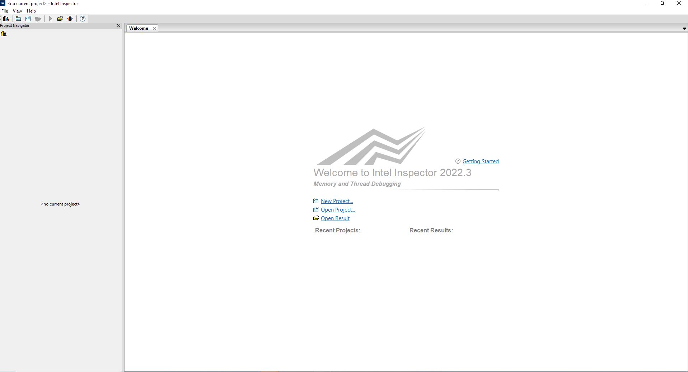
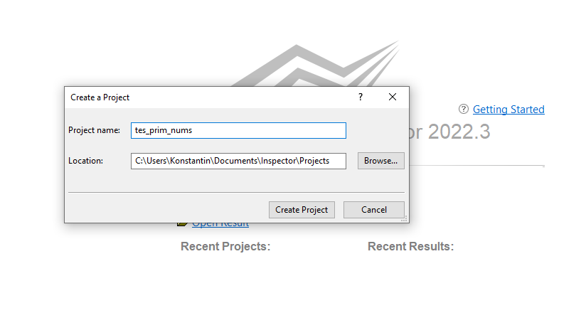
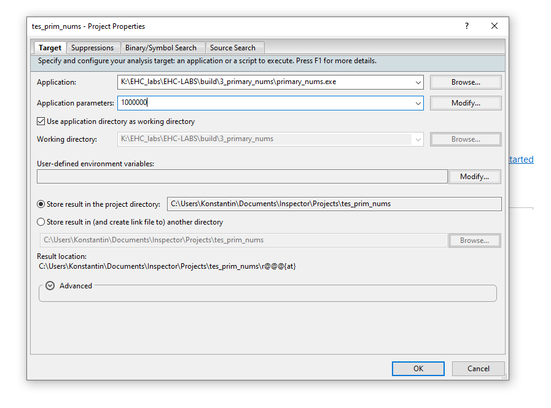
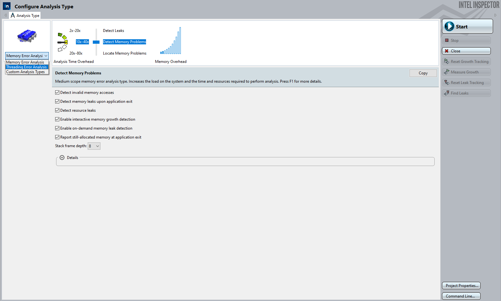
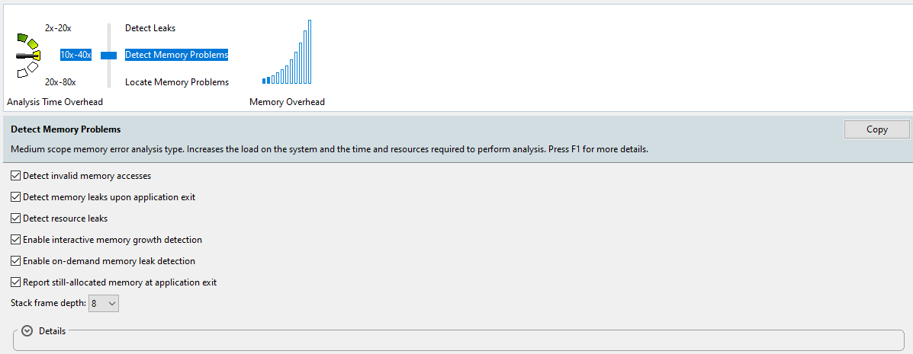
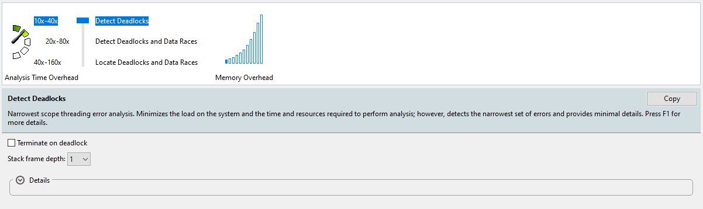
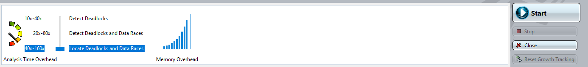
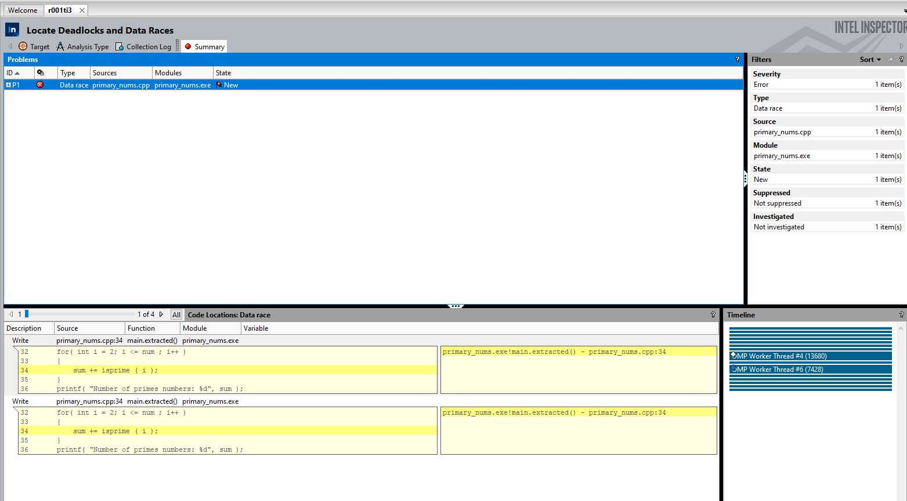

## План работы

- [Настройка окружения](/tutorials/Настройка%20окружения.md)
- [Введение в OpenMP](/tutorials/Введение%20в%20OpenMP.md)

Данный мастер класс является небольшим продолжением [MC#3](/tutorials/MC#3.md)

После него остается еще один незакрытый вопрос: а корректно ли отрабатывает многопоточная программа?

При добавлении параллелизма возникает ряд новых проблем, которые в силу параллельной своей природы могут просто не проявиться сразу, а возникнуть через время. Речь далее пойдет про такие вещи, как гонка данных, некорректная работа с выделяемой памятью.

Для примера рассмотрим пример с определением кол-ва простых чисел на промежутке от 2 до N, который ранее уже разбирался на прошлом занятии.

```c++
...
    int sum = 0;
#pragma omp parallel for
    for( int i = 2; i <= num ; i++ )
    {
        sum += isprime ( i );
    }
    printf( "Number of primes numbers: %d", sum );
...    
```

Ранее мы уже говорили о том, что в данном случае, результат работы программы будет нокорректным в силу того, что sum - разделяемая переменная для потоков из описанной выше параллельной секции. Так что если не защищать ее от многочисленных попыток одновременного чтения/записи из параллельных потоков, то результат будет строго говоря, неопределенным.

Но что если вы каким-то образом случайно пропустили это место, как быть тогда. Сразу эта проблема может не проявится, может вам повезет, и программа N раз, пока вы ее тестируете, выдаст правильный ответ. 

Для того чтобы находить такие ошибки, можно воспользовать инструментом Intel Inspector

По интерфейсу он уже должен быть вам знаком по предыдущим инструментам из oneAPI


Стартовая страница, на которой можно создать новый проект или открыть существующий

Выбираем `New Project`




Можно задать небольшой размер задачи

Далее выбираем `New Analysis`



В обозревателе проекта можно выбрать тип анализа:
- Memory Error
- Threading Error
- Custom

В данном случае нас интерисуют первые два



Memory Error позволяет находить такие проблемы, как некорректные доступы к памяти, выходы за пределы массивов, работа с непроинициализированной памятью и прочее.
Также можно обнаружить и утечки памяти.



Threading анализ дает нам информацию о наличии дедлоков и гонок данных

Собственно, его давайте и запустим.





Проблема с гонкой данных обнаружена, теперь нужно идти и исправлять ее. Место, в котором обнаружена проблема в отчете инструмента подсвечено желым цветом.

Можно варьировать степень подробности анализа в конфигурации проекта и попробовать проанализировать другие приложения.
