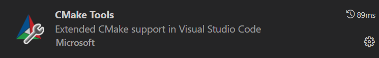
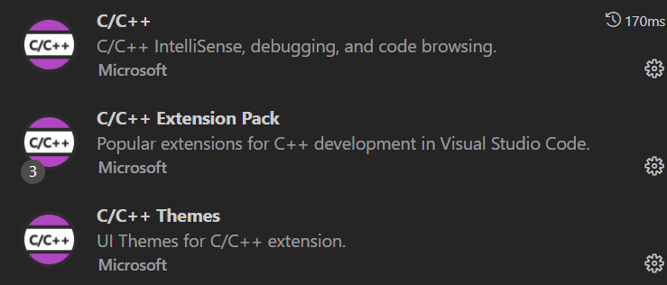
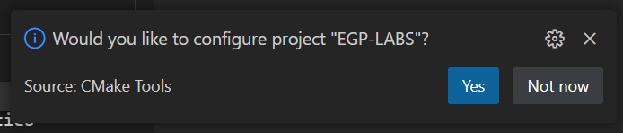
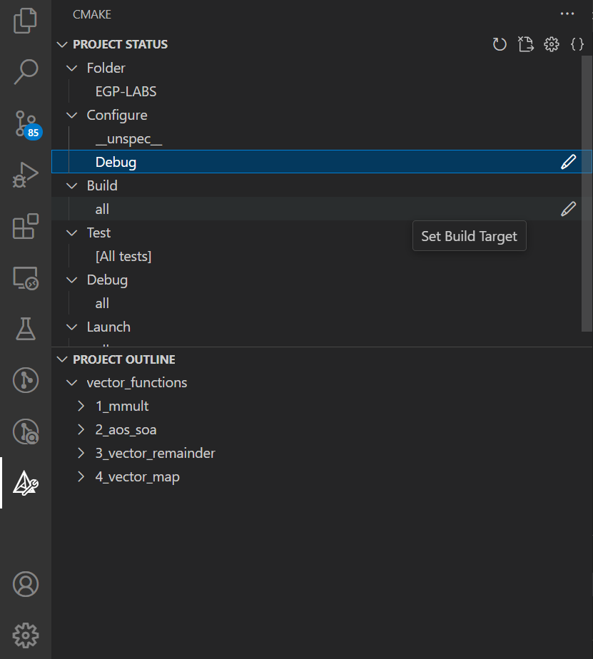
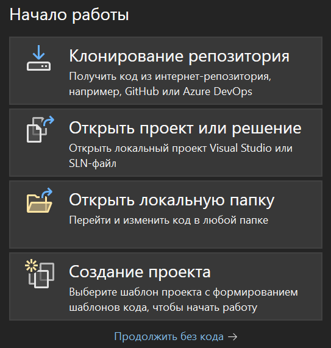
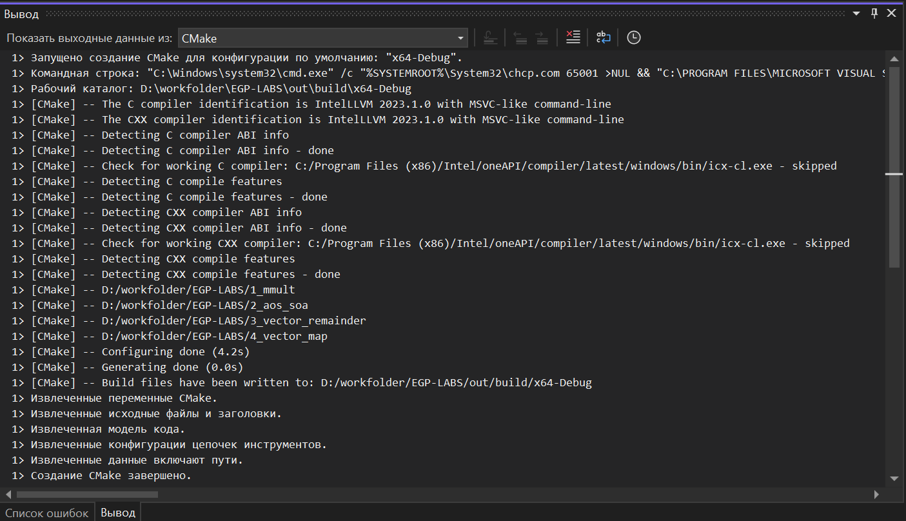
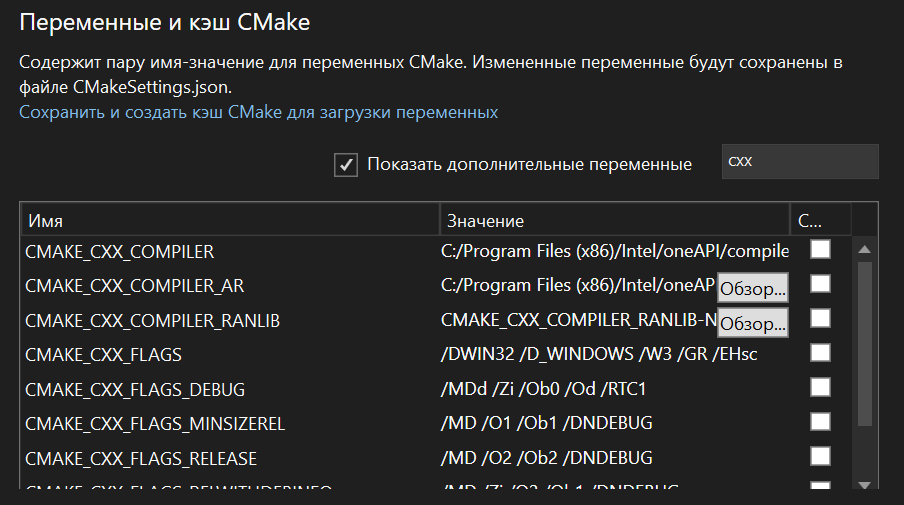
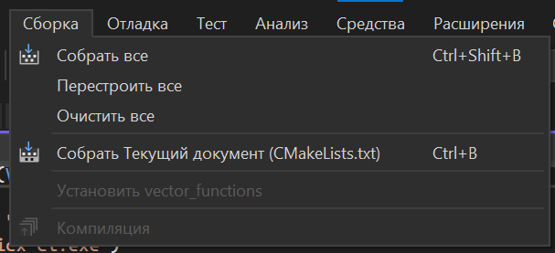

# Lab1. Настройка окружения. Некоторые методы повышения производительности приложения. Эффективность работы с подсистемой памяти. Векторизация.
## Подготовка к выполнению лабораторных работ

1. Необходимо установить инструменты из пакета __Intel oneAPI__:  
    - compiler
    - advisor
    - vtune
    - inspector
    > Первые три доступны в рамках __Intel oneAPI Base Toolkit__. Последний в __Intel oneAPI HPC Toolkit__.

2. Настройка окружения
    Для успешной сборки проекта, запуска собранных исполняемых файлов и инструментов анализа из командной строки, необходимо настроить окружение.

    Со всем этим может помочь скрипт `setvars.bat`, который располагается в корневой папке с установленными иснтрументами из пакета __oneAPI__. Например, путь до него может быть следующим:  
    ```
    "C:\Program Files (x86)\Intel\oneAPI\setvars.bat"
    ```
    Для запуска скрипта нужно открыть командную строку: `win + s` -> ищем `cmd` (Командная строка) и запускаем это приложение. Далее в открывшейся командной строке вводим полный путь до скрипта, описанного выше, после чего в консоли появится следующее:
    ```
    Microsoft Windows [Version 10.0.19044.2728]
    (c) Корпорация Майкрософт (Microsoft Corporation). Все права защищены.

    C:\Users\k.sandalov>"C:\Program Files (x86)\Intel\oneAPI\setvars.bat"
    :: initializing oneAPI environment...
    Initializing Visual Studio command-line environment...
    Visual Studio version 17.6.1 environment configured.
    "C:\Program Files\Microsoft Visual Studio\2022\Community\"
    Visual Studio command-line environment initialized for: 'x64'
    :  advisor -- latest
    :  compiler -- latest
    :  debugger -- latest
    :  dev-utilities -- latest
    :  dpl -- latest
    :  tbb -- latest
    :  vtune -- latest
    :: oneAPI environment initialized ::

    C:\Users\k.sandalov>
    ```

    Все дальнейшие запуски собранных исполняемых файлов и инструментов рекомендуется делать из этой же командной строки

    Для того, чтобы ваш проект в VS Code можно было собрать встроенными средствами для работы с проектами CMake, нужно указать правильный путь до этого скрипта в [cmake-kits.json](../.vscode/cmake-kits.json), в переменной **environmentSetupScript**

    Затем открываем IDE, используя эту же командную строку.
    - VS Code
        
        Для запуска VS Code можно ввести команду в терминале:
        ```
        C:\Users\k.sandalov>code
        ```
        Для работы с проектом в VS Code нужны следующие расширения (Скачать можно на вкладке *Extensions*):    
        
        <p align="center">
        
        </p>  
        
        <p align="center">
        
        </p>
        
        Далее в открывшемся окне переходим в верхнем меню к выбору папки, в которой располагается проект(корневая директория проекта): 
        
        <p align="center">
        
        </p>

        После открытия папки с проектом должно появиться сообщение с предложением сконфигурировать CMake проект, необходимо сделать это (выбираем DPC++):

        <p align="center">
        
        </p>

        Если скофигурировать проект по какой-то причине не предлагает, то самостоятельно открываем Command Palette (ctrl + shift + p) и там вводим ```>CMake: Select a Kit```

        Для удобной работы с CMake проектом можно воспользоваться меню слева:

        <p align="center">
        
        </p>

        В панели project outline есть возможность очистить и переконфигурировать весь проект, собрать весь проект или же собрать отдельные таргеты (исполняемые файлы отдельных лабораторных работ).

        Еще немного информации о cmake проекте. В cmake-kits.json указаны начальные параметры концигурации проекта: 
        
        - выставлен verbose = 1, который нужен для вывода в консоль подробного описания процесса сборки исполняемых файлов

        - используемые компиляторы и опции компиляции. Важно, если вы будете менять указанные опции, то необходимо будет очистить и переконфигурировать весь проект (это можно сделать через CMake расширение, либо удалить build папку вручную и запустить конфигурацию заново)

        **ВАЖНО**

        В каждой директории с лабораторной или самостоятельной работой лежит свой CMakeLists.txt файл. Если добавляете какие-то опции компиляции, например, для оптимизации, лучше делать это в нем, заготовка там есть, просто добавляете опции и следите, что при компиляции в выводе нет предупреждений (warning или error), что компилятор с такой опцией не работает.
        Эти опции не кэшируются, так что достаточно просто пересобирать нужный вам таргет.

    - Visual Studio

        Для запуска Visual Studio используем команду:
        ```
        C:\Users\k.sandalov>devenv
        ```  
        Далее необходимо так же, просто открыть папку с проектом:

        <p align="center">
        
        </p>

        В случае, если была корректно выбрана корневая директория проекта и настроено окружение, Visual Studio успешно сможет настроить CMake проект:

        <p align="center">
        
        </p>

        Далее настройки проекта в первую очередь будут браться из файла `CMakeLists.txt` (смотрите справа в обозревателе решений). Однако так же есть возможность настраивать его через файл `CMakeSettings.json`. Для этого можно использовать переменные и кэш CMake:

        <p align="center">
        
        </p>

        А для того, чтобы заново переконфигурировать проект можно заново создать кэш CMake, если до этого обновили значения каких-то переменных, чтобы использовались актуальные значения (Удалить кэш и выполнить перенастройку):

        <p align="center">
        
        </p>

        Для сборки используем пункт меню сборка -> перестроить все:

        <p align="center">
        
        </p>
