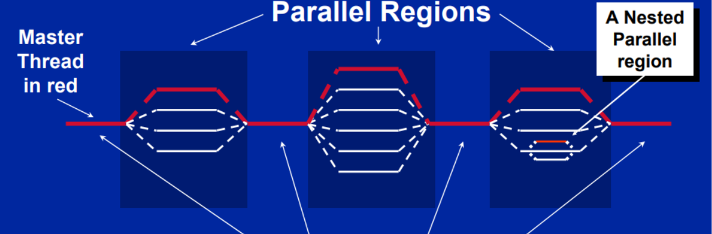
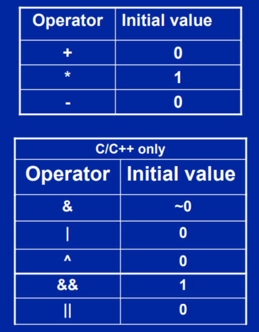
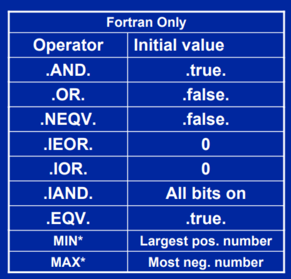

	# Введение в OpenMP

- [Начнем с небольшого примера](#first_example)
- [Создание потоков. Fork-join модель](#fork-join)
- [Синхронзация](#sync)
- [Параллельные циклы](#for_loop)

## <h2 id="first_example">Начнем с небольшого примера</h2>

Основа синтаксиса программной модели **OpenMP** - директивы препроцессора, или так называемые прагмы, например:
`#pragma omp construct [clause[clause]]`

В дополнение к этому могут использоваться так же переменные окружения либо библиотечные функции, подключаемые через:
`#include <omp.h>`

Большинство директив **OMP**  применяются к блоку кода. Блок кода - структурная единица кода в ЯП, имеющая одну точку входа и одну точку выхода, состоящая из набора инструкций

```c++
#include <iostream>

int main() {
	int ID = 0;
	std::cout << "Hello (" << ID << ") ";
	std::cout << "world (" << ID << ")\n";
	return 0;
}
```

```text
Output: 
Hello (0) world (0)
```

```c++
#include <iostream>

int main() {
	#pragma omp parallel
	{
		int ID = 0;
		std::cout << "Hello (" << ID << ") ";
		std::cout << "world (" << ID << ")\n";
	}
	return 0;
}
```

```text
Output:
Hello (Hello (0) world (0)
0) world (0)
```

В данном примере, при добавлении директивы, необходимо выделить ту часть кода, которая будет запускаться в параллель, в отдельный блок `{}`
и перед ним поставить эту директиву.
Тогда этот блок кода уже будет назваться **регионом параллельного кода**.
Можно заметить, что в выводе получается какая-то мешанина. Давайте попробуем ее отделить, и понять, что какому потоку пренадлежит:

```c++
#include <iostream>
#include <omp.h>

int main() {
	#pragma omp parallel
	{
		int ID = omp_get_thread_num();
		std::cout << "Hello (" << ID << ") ";
		std::cout << "world (" << ID << ")\n";
	}
	return 0;
}
```

```text
Output:
Hello (Hello (0) world (0)
1) world (1)
```

Для этого можно воспользоваться библиотечной функцией `omp_get_thread_num()`. Эта функция, при вызове внутри параллельного региона вернет номер идентификатора потока, в котором код в данный момент исполняется.

Праграммная модель **OMP** основана на использовании разделямой памяти. Таким образом, параллельные потоки могут коммуницировать через обмен данными, разделяемыми переменными. Однако необходимо помнить о важности контроля доступов к разделяемым данным из нескольких потоков, и что может возникнуть такая ситуация, как **гонка данных**.

Так, например, в коде выше, из-за того, что потоковый ввод-вывод одновременно использовался разными потоками одновременно, возникла мешанина из вывода в консоль.

**Попробовать самостоятельно решить проблему с выводом в консоль из разных потоков.**

## <h2 id="fork-join">Создание потоков. Fork-join модель</h2>


На рисунке выше представлена модель паралеллизма fork-join, лежащая в основе **OMP**. Суть ее проста: есть главный поток (**Master Thread**), который отвечает за создание группы параллельных потоков, которые будут, совместно с главным потоком, решать задачи (**Parallel Task I, II и III**). Помимо этого, порожденные потоки внутри параллельного региона могут создавать еще группы потоков, таким образом, создавая уже модель вложенного параллелизма



Тогда программа будет представлять из себя чередующуюся последовательность из участков последовательного кода, однопоточные, и многопоточных участков.

```c++
#include <iostream>
#include <omp.h>

int main() {
	omp_set_num_threads(4);
	#pragma omp parallel
	{
		int ID = omp_get_thread_num();
		std::cout << "Hello (" << ID << ") ";
		std::cout << "world (" << ID << ")\n";
	}
	return 0;
}
```

В данном случае программа будет иметь следующую структуру: Сперва исполняется последовательный код, до момента начала параллельного региона, для которого создается набор параллельных потоков, которые будут исполнять свою копию кода (со своим уникальным значением ID), после чего, в конце региона, они сойдутся, и дальше, до конца работы программы, будет выполняться снова один поток.

```c++
#include <iostream>
#include <omp.h>

int main() {
	const char* name = "world";
	#pragma omp parallel num_threads(4)
	{
		int ID = omp_get_thread_num();
		std::cout << "Hello (" << ID << ") ";
		std::cout << name <<" (" << ID << ")\n";
	}
	return 0;
}
```

Еще один способ задать количество параллельных потоков непосредстенно только для параллельного региона - использовать **num_threads(N) clause** для прагмы.

При этом, важно отметить, что переменная ID будет уникальна для каждого потока, тогда как name уже будет общей, разделяемой переменной для них.

## <h2 id="sync">Синхронизация</h2>

Для доступа к разделяемым переменным, в тех ситуациях, когда их значения обновляются и считываются из разных потоков, необходимо использовать примитивы синхронизации. Есть верхнеуровневые примитивы синхронизации и нихкоровневые.
К верхнеуровневым можно отнести:

- Критические секции
- Атомарные операции
- Барьеры
- Упорядочивание доступов к данным

### Критические секции

```c++
#include <iostream>
#include <omp.h>

int main() {
	const char* name = "world";
	#pragma omp parallel num_threads(4)
	{
		int ID = omp_get_thread_num();
		#pragma omp critical
		{
			std::cout << "Hello (" << ID << ") ";
			std::cout << name <<" (" << ID << ")\n";
		}
	}
	return 0;
}
```

```text
Output:
Hello (0) world (0)
Hello (3) world (3)
Hello (1) world (1)
Hello (2) world (2)
```

В данном примере, для того чтобы разграничить выводимые в консоль сообщения, как раз таки можно воспользоваться критической секцией, которая в каждый момент времени может выполняться строго одним потоком из параллельного региона.

### Атомарные операции

```c++
#include <iostream>
#include <omp.h>

int func() {
	int ret_val{};
	for (int i = 0; i < 10; ++i) {
		++ret_val;
	}
	return ret_val;
}

int main() {
	int sum{};
	#pragma omp parallel num_threads(4)
	{
		int local_sum = func();
		#pragma omp atomic
		sum += local_sum;
	}
	
	std::cout << sum << std::endl;
	return 0;
}
```

Однако в некоторых случаях вовсе нет необходимости в обеспечивании последовательного исполнения блока инструкций, а всего навсего нужно обеспечить последовательный доступ к одной единственной переменной. Тогда на помощь могут прийти атомарные операции, как в примере выше.

## <h2 id="for_loop">Параллельные циклы</h2>

Создаваемые по умолчанию потоки, как это было в примерах ранее, выполняют копию одного и того же кода параллельного региона (**SPDM - Single Program Multiple Data**). 
Для какого-то разделения работы (**worksharing**) между потоками параллельного региона, вместо простого дублирования, можно воспользоваться библиотечными функциями для определения контекста исполнения кода параллельного региона.
В качестве контекста здесь рассматривается, например, номер потока, исполняющего параллельный регион. Чтобы получить информацию о текущем потоке можно воспользоваться методом `omp_get_thread_num()`.
Тогда, например, можно разделить M итераций исходного цикла на K частей между N потоками, где K = M/N.

Но более удобным в данном случае, когда есть цикл, итерации которого можно обрабатывать в параллель, будет подход с использованием `#pragma omp parallel for`

К используемой ранее прагме добавляется еще одно слово, указывающее на то, что итерации следующего за прагмой цикла можно запустить в параллель.

Естественно, итериций цикла может быть сильно больше имеющегося числа потоков, тогда они будут либо динамически, либо статически распределены между имеющимися потоками.

```c++
#include <iostream>
#include <omp.h>

int main() {
	int sum{};
	#pragma omp parallel for
	for (int i = 0; i < 1000; ++i)
	{
		#pragma omp atomic
		sum += 1;
	}
	
	std::cout << sum << std::endl;
	return 0;
}
```

В данном случае переменная i будет локальной для каждого потока, а sum - разделяемая.
Мотивацией для использования конструкции параллельного цикла может послужить следующий пример кода:
Последовательная версия

```c++
for(i=0;I<N;i++) { a[i] = a[i] + b[i];}
```

Параллельная без **parallel for**

```c++
#pragma omp parallel
{
	int id, i, Nthrds, istart, iend;
	id = omp_get_thread_num();
	Nthrds = omp_get_num_threads();
	istart = id * N / Nthrds;
	iend = (id+1) * N / Nthrds;
	if (id == Nthrds-1) iend = N;
	for(i=istart;I<iend;i++) { a[i] = a[i] + b[i];}
}
```

С использованием **parallel for**

```c++
#pragma omp parallel
#pragma omp for
for(i=0;I<N;i++) { a[i] = a[i] + b[i];}
```

Да, использование **omp for** конструкции можно как в примере ранее совместить с объявлением параллельного региона: **omp parallel for**, либо же вынести отдельно.

```c++
#include <iostream>
#include <omp.h>

int main() {
	int sum{};
	int i;
	#pragma omp parallel for
	for (i = 0; i < 1000; ++i)
	{
		#pragma omp atomic
		sum += 1;
	}
	
	std::cout << sum << std::endl;
return 0;
}
```

Для итератора параллельного цикла, в примере выше - переменная i, создается локальная копия для каждого потока, то есть, для нее нет необходимости в атомарном доступе.

Задание: Посмотрите на пример выше, сравните две переменные: i и sum. Обе переменные меняются на каждой итерации в параллельном цикле. Однако для i атомарный доступ не используется, а для sum - да. Вопрос: как здесь можно избежать издержек на атомарный доступ для переменной sum?
 
 **Подсказка: В ответе можно воспользоваться модификаторами для прагмы, либо же вовсе обойтись без них**.

Далее последует описание решения возникшей проблемы.

### Редукция

Возникшая выше ситуация описывает стандартный паттерн в параллельных вычислениях, когда необходимо аккумулировать в какой-то переменной результат вычислений из параллельных потоков. И тогда между итерациями параллельного цикла возникает реальная зависимость по данным, которую можно разрешить с использованием редукции.
Редукция позволяет разделить одну глобальную переменную на N копий, каждую для отдельного потока. Произвести над ними манипуляции так же локально по потокам, после чего, по завершении параллельного региона, собрать все зачения воедино. Такой подход применим, в частности, тогда, когда необходимо получить сумму или произведение каких-то чисел со всех потоков в одной переменной.
Тогда оптимальным решением будет следующее:

```c++
#include <iostream>
#include <omp.h>  

int main() {
	int sum{};
	int i;
	#pragma omp parallel for reduction(+:sum)
	for (i = 0; i < 1000; ++i)
	{
		sum += 1;
	}
	std::cout << sum << std::endl;
	return 0;
}
```

для reduction в качестве аргументов задается глобальная переменная, в которой необходимо собрать значения (локальные копии) со всех потоков, а так же операция, способ, которым эти значения будут объединены в формате (операция:переменная).

[Подробнее про редукцию](https://www.openmp.org/spec-html/5.0/openmpsu107.html)

Начальные значения локальных копий редуцируемой переменной будут задаваться в зависимости от выполняемой операции редукции (для + это 0, а для * - 1).



